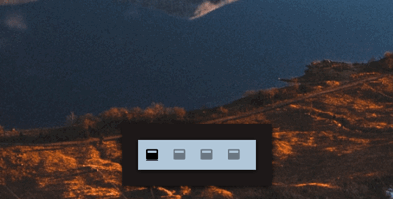
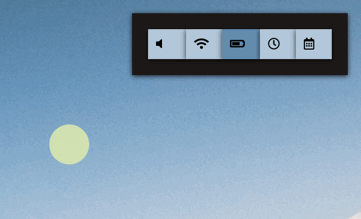
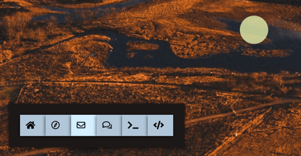

# Supernerd

Sweet-ass (double!) menu bar replacement / widget pack for  [Übersicht](http://tracesof.net/uebersicht/). Originally built on top of  splintah/[nerdbar.widget](https://github.com/splintah/nerdbar.widget), it spiralled out of control and has grown to be a beast of its own. Anyways, Nerdbar is amazing, Supernerd sucks pretty bad. But it does look *pretty damn sweet*.


# Indicators
* **Player**    displays information about the track that is currently playing in either Spotify or iTunes. Easy to extend for your favourite music player.
* **Focus**     shows the title of the window currently focused. You need this mostly only if you have removed titlebars like I did. Why did I do it? Because it looks cool af, that's why. Also saves screen real estate.
* **Info**      Volume, wifi, battery, time and date
* **Links**     Handy app/location launcher. Comes set up with home folder, Safari, Mail, WhatsApp, Hyper and Atom, but can be configured very easily – take a look in `app-launcher.coffee` and Find+Replace any of those apps with the name of your favorite. It's that easy.
* **Desktop**   Graphically displays which desktop you are in. Goes up to four desktops by default. Look at this lil bitch:

* **Sysmon**    Displays cpu, ram, and hard disk usage, with cool colours which reflect the load.

## Cool Shit
I honestly have not seen any other menubar widget that is has this level of pointless and cool eye candy.

* **Adaptive Colors & Icons**   Want to master knowing what your mac is up to in a glance? Most of the indicators are color-coded, so the widget's colors reflect the load / usage / etc. System monitors, such as the CPU monitor change color as the get more loaded, the battery as it's drained, the volume as it lowers, etc. Icons are adaptive too where applicable: volume, battery, wifi, etc. all change to reflect their status.
* **Collapsible Buttons**       Certain indicators are collapsible and will only show their full value when hovered with the mouse. Thanks to the *adaptive colors* you already know superficial information just by looking at them.


What??? WOW!

* **Notification**              You can enable notifications and buttons will light up discreetly to let you know when there is one. Check this out:



Does this really work? No! I'm still working on making it go off correctly.

If you're worried about resources, disabling any of these anymations is a matter of deleting one .css block, so do it or ask me do to it. I probably will.

In order to use all of this, you must renounce interacting with your desktop icons. I know, I know. But since using your desktop like a 'put shit here' folder is not a good idea, this might actually help you. Do so:
`defaults write com.apple.finder CreateDesktop -bool FALSE;killall Finder`

When you're ready to revert back to your barbarian-like usage of your desktop/dumpster, do this:
`defaults delete com.apple.finder CreateDesktop;killall Finder`

## Customisation

Customisation is **super** easy. Thanks to the amazing work of [davidlday](https://github.com/davidlday) Supernerd is now the only menubar replacement which employs a single .css for the entire system, while also having each widget coded in a separate file. This means you can:
* Customise the appearance of all widgets by editing just one .css file. Except for positioning, 99% of the CSS is shared on a class basis, so it will apply to each and every widget. The positioning part being separate makes it easy to put widgets where you want them.
* Handle widgets on a per-object basis. Since the logic of the widget is in separate individual files, it's easy to hack into them and get them to work the way you want to, or to disable them one-by-one.

Supernerd is also fully compatible with wal / pywal, and if you select the correspondent .css, named colors-wal.css, for import in the bar-top.coffee component, it will automatically adjust to wal's colors.

Currently Supernerd ships with only one alternative to the default theme:
* floating.css


Select it by Find+Replace `default.css` in `bar-top.coffee` with the name of the theme you'd like to load – or make your own css.

# Installation
(You know you want it.)

1. [Install Übersicht](http://tracesof.net/uebersicht/).

2. Clone this repository to your Übersicht widgets:

```bash
git clone https://github.com/blahsd/supernerd.widget $HOME/Library/Application\ Support/Übersicht/widgets
```

# Credits
* [splintah/nerdbar.widget](https://github.com/splintah/nerdbar.widget): tons of code that I took shamelessly and adapted/expanded. Definitely would not have done supernerd if it wasn't for this code.
* [davidlday/supernerd.widget](https://github.com/davidlday/supernerd.widget): this man gave us CSS separated from the code logic. He made it possible to have each widget split in a different file while maintaining the level of customisability we're used to. No way to thank him enough.
* [herbischoff/nerbar.widget](https://github.com/herrbischoff/nerdbar.widget): most of the original nerdbar widget.
* [Pe8er/playbox.widget](https://github.com/Pe8er/Playbox.widget): the script that fetches information from iTunes, which I recklessly mutilated for use with supernerd.
* [syndresorhus/hyper-snazzy](https://github.com/sindresorhus/hyper-snazzy): I copied the sweet colors of the `snazzy` theme from here.
* [Wallpaper] (https://unsplash.com/photos/5KNecHxjTnI)
* Me. I mean, I think I did a pretty good job. [Buy me a coffe](https://www.patreon.com/blahsd) or [thoughts & prayers](https://www.thoughtsandprayersthegame.com).
